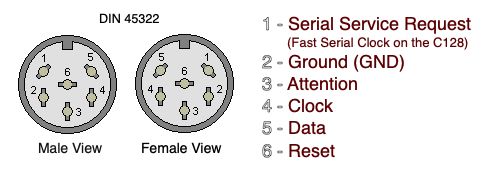

# IEC-printer - Arduino Installation

This Arduino UNO R4 Wifi sketch sends raw print data from a C64 to a Raspberry PI for printing to a USB or wifi printer, handling all IEC protocol handshaking and communication using the  [IECDevice](https://github.com/dhansel/IECDevice) library.

# Installation
1. Create a file named config.h with the following content:
```
// WiFi credentials - REPLACE with your network details
char ssid[] = "your_SSID";
char pass[] = "your_PASSWORD";
// Server details - REPLACE with your server's IP address or hostname. This is where the Python script to receive the print data will be running.
char server[] = "raspberrypi.local";
int port = 65432;
```
2. Install the IECDevice library to your Arduino libraries dir (assuming Mac OS for this example):
    * cd ~/Documents/Arduino/libraries
    * git clone https://github.com/dhansel/IECDevice.git
3. Once config.h has been created and the IECDevice library has been installed, compile the sketch and upload with the Arduino IDE.
4. Connect the C64 to the Arduino with an IEC cable via the following pins:
    - IEC GND to Arduino GND
    - IEC ATN to Arduino digital pin 3
    - IEC CLK to Arduino digital pin 4
    - IEC DATA to Arduino digital pin 5
    - 
5. Use the Serial Monitor as needed to view logs.
6. FYI - There is currently a 90 second timeout in place so larger print jobs like banners and certificates do not print prematurely. This unfortunately means that all print jobs will print 90 seconds after the job is done. This will hopefully be fixed in a later version by recognizing commands indicating the full job is complete.

# Info
This implementation uses the IECDevice library by David Hansel (https://github.com/dhansel/IECDevice) which provides robust, well-tested IEC protocol handling. The library properly handles multi-device scenarios, ensuring the printer coexists peacefully with disk drives and other IEC devices.

# License
This code is distributed under the GNU Public License
which can be found at http://www.gnu.org/licenses/gpl.txt

# DISCLAIMER:
The author is in no way responsible for any problems or damage caused by using this code. Use at your own risk.